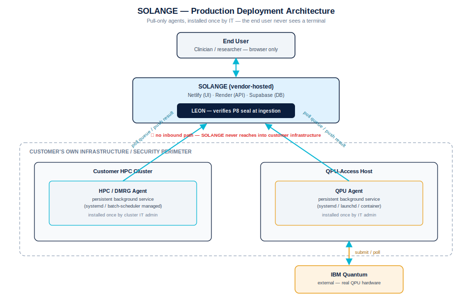

# SOLANGE — Production Deployment Model

*How the system is meant to run once it is deployed at a customer site — as
distinct from the proof-of-concept operator workflow used during this
dissertation's development (see `scripts/laguna/STARTUP_GUIDE.md`).*

## The core distinction

Today, running SOLANGE end-to-end requires a developer/operator to open
terminals, SSH into a cluster, and start pull-agents by hand. That is a
**proof-of-concept workflow**, not a limitation of the architecture. Even
today, the moment an agent is running, the end user never touches a
terminal again — they only ever use the SOLANGE web app. The gap is
entirely in *who starts the agent, and how* — not in what the end user
experiences day to day.

| | Proof of concept (today) | Production (at a customer site) |
|---|---|---|
| Who starts the agent | The researcher, by hand, in a terminal | IT admin, once, during deployment |
| How it starts | `bash agent_keepalive.sh start` | A registered background service (systemd / launchd / container) |
| Survives reboot | No — must be re-run | Yes — auto-starts on boot |
| End-user experience | Same as production: browser only | Browser only |

## The architecture

Three trust zones, one governance boundary:

1. **End user** — a clinician or researcher, browser only. Never sees a
   terminal, never holds a credential.
2. **SOLANGE (vendor-hosted)** — the UI, API, and database. **LEON**
   re-verifies the cryptographic seal on every record the moment it arrives
   (P8 for HPC/QPU energy records, the generic seal for DMRG
   classifications) — nothing is trusted on the strength of where it came
   from.
3. **Customer infrastructure** — the HPC cluster and the QPU-access host,
   both inside the customer's own security perimeter. Each runs one
   **persistent background agent** that polls SOLANGE's dispatch queue over
   an *outbound-only* connection, claims a job, executes it with full local
   privileges, and pushes the sealed result back out the same way.

**No arrow ever points from SOLANGE into customer infrastructure.** This is
not a production simplification of the DP2 pull-architecture already used
in this dissertation's proof of concept (§06.ii) — it is the *same*
principle, just installed as a managed service instead of a manual script:

- No credential for the customer's cluster or QPU account is ever stored
  outside that customer's own boundary.
- No inbound channel exists for SOLANGE to reach into either environment.
- The human-authenticated session that gates access today (2FA at login)
  is replaced, at production scale, by the IT admin's own authenticated
  install of the service — not removed.

## What changes for a real deployment

- **HPC / DMRG agent** → registered as a `systemd` unit (Linux) on a node
  with cluster access, or integrated with the site's batch scheduler as a
  long-running job. Installed once by the cluster's IT/HPC admin.
- **QPU agent** → registered as a `systemd` unit / macOS `launchd` agent /
  container, on any machine with reliable outbound internet to the QPU
  vendor (IBM Quantum or otherwise) and the customer's own QPU credentials.
  Installed once by IT.
- **Credentials** → the customer's own IBM Quantum (or equivalent) account,
  configured once at install time — never the vendor's, never shared
  across customers.
- **End user** → unchanged. Opens the browser, logs in, sees a green dot
  when an agent is healthy, queues work, watches results land.

## Why this matters for the governance claim

A common failure mode for "governed AI/HPC/QC orchestration" pitches is
that the governance model quietly assumes a research operator willing to
babysit terminals — which does not survive contact with a real regulated
deployment (a hospital, a pharma R&D group) where the end user is a
clinician, not a systems engineer. Separating *installation* (IT, once)
from *use* (clinician, always browser-only) is what makes the P1–P9 /
LEON / DP1–DP4 governance model in this dissertation credible as something
that could actually ship — not only as a research demonstration.
